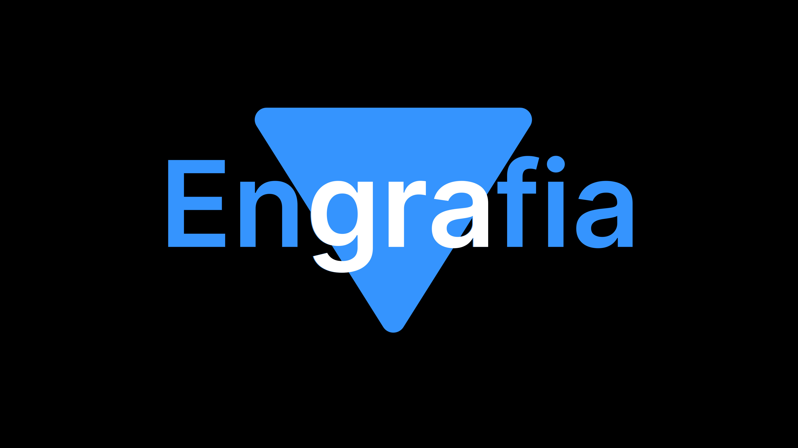

# Engrafia

## The easiest way to write docs for your project.



Docs - https://engrafia.vercel.app/

Engrafia is an open-source project designed to build documentation websites without any effort. Engrafia is built up NextJs, which means that you have the power, and performance of NextJs to build your documentation.

## Motivations

The main concepts of Engrafia are to provide a better option to build a website for documentation with no effort, something to make you stay focused just on writing your documents, don't worry about things like configs, and layouts, stay focused on writing MD, and MDX files.

## Technologies

- [React](https://reactjs.org/)
- [NextJS](https://nextjs.org/)
- [Next UI](https://nextui.org/)
- [React Icons](https://react-icons.github.io/react-icons/)

## Creating a new documentation

This is the default process to start a new Engrafia application, open the terminal and run the following command:

```bash
npx create-engrafia create
```

This command will guide you through some steps to decide which template would you like to use. After those steps, you will have a new application up to production.

## Development mode

To write new documents, it's useful if your development environment is up, otherwise, you will not be able to see live changes on the docs you are writing.

Do that by running the command `yarn dev`, the development environment will be available at [`http://localhost:3000`](http://localhost:3000)

### MD files

To write a new document you need to create a new `md` or `mdx` file, and add some metadata, like `title`, `description`, `tags`, and an optional property `position`, which is used to define the position of the item in a menu category.

> If you are new to `md`, and `mdx` files, you can read the documentation [here](https://www.markdownguide.org/)

```mdx
---
title: 'Quick start'
description: 'This section will guide you through principals' ideas and how to start to use them.'
position: 0
---

# Quick start

Engrafia is an open-source project designed to build documentation websites. without any effort. Engrafia is built up NextJs, which means that you have the power, and performance of NextJs to build your documentation.
```

```mdx
# H1 heading

## H2 heading

This is a list in markdown:

- One
- Two
- Three
```

### Images

If you want to add images to your documentation, just add them to the public folder at the root of your project, and after that, link them to your document.

```md
    
```

## Production mode

Okay, after you wrote some documents, you want to publish them to the world, so let's start, by choosing the place you want to deploy them. Engrafia is built up NextJs, so the best choice should be Vercel, but there is more than just one good option to do that, wherever you can deploy a NextJs application, you can deploy an Engrafia application too.

To have a production artifact you just need to run the following command `yarn build`.

Done!
